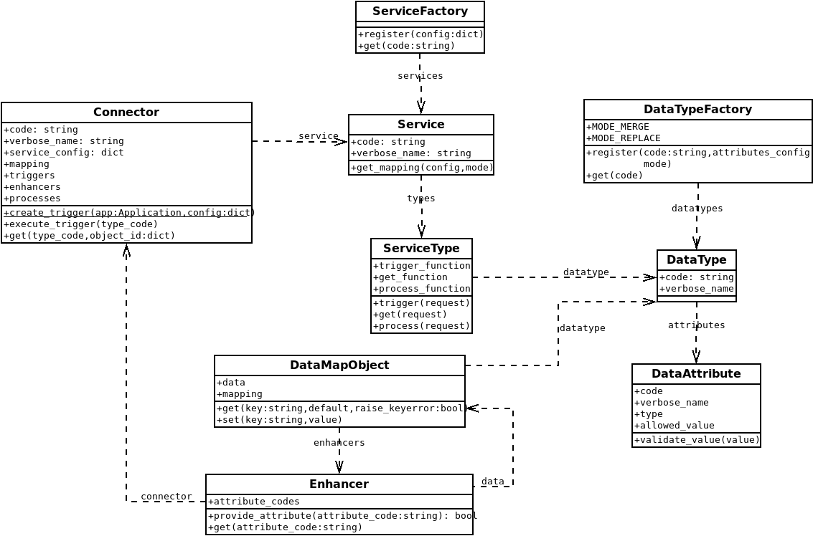

Introduction
============

Xenops is a simple program to sync data like (customers/products) between different systems.

Go to setup project for creating a new project.

Go to setup service for creating a new service for xenops.

System flow
-----------

1) A trigger is run manually or by cron.
2) Service yield new or updated data.
3) Data is wrapped around data mapper object, that can get values based on given mapping.
4) Data mapper object is given to a process service that is registered.

Core Class diagram
------------------

